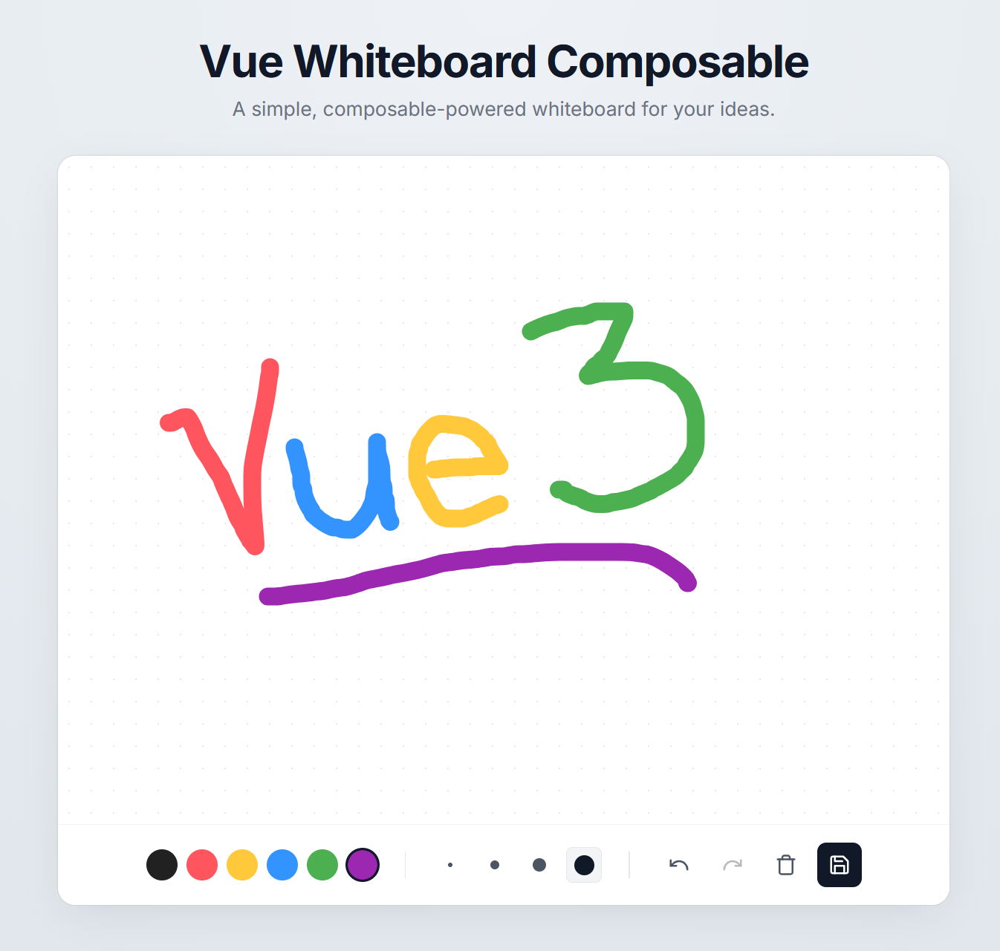

# vue-whiteboard-composable

A **Vue 3 composable** for canvas-style drawing on an SVG. Built with Vue 3 and [d3](https://d3js.org/), inspired by [ng-whiteboard](https://github.com/mostafazke/ng-whiteboard).

No styles or UI. You provide the SVG element and optional options; the composable handles drawing, undo/redo, and export.

**Features:**

- Touch and pointer support (via d3-drag)
- Reactive options: brush color, size, background, linecap/linejoin
- Undo & redo
- Full history access & navigation
- Export as PNG (base64)
- **Serialization & Persistence** support



## Install

```bash
pnpm add vue-whiteboard-composable
# or
npm i vue-whiteboard-composable
```

## Local Development

If you'd like to try out the demo app locally, you can clone the repository and run the development server:

```bash
git clone https://github.com/opista/vue-whiteboard-composable.git
cd vue-whiteboard-composable
pnpm install
pnpm dev
```

Visit `http://localhost:5173` to have a play with the whiteboard!

## Usage

Use a template ref for your SVG container and call `useWhiteboard` with it (and optional options). The composable initializes when the ref is set and returns actions and state.

```vue
<script setup lang="ts">
import { ref } from 'vue'
import { useWhiteboard } from 'vue-whiteboard-composable'

const svgRef = ref<SVGSVGElement | null>(null)
const color = ref('#333333')
const size = ref('5px')

const {
  undo,
  redo,
  clear,
  save,
  canUndo,
  canRedo,
  history,
  currentIndex,
  jumpTo,
  removeFromHistory,
} = useWhiteboard(svgRef, {
  color,
  size,
  backgroundColor: '#ffffff',
})
</script>

<template>
  <svg ref="svgRef" class="my-whiteboard" />
  <div class="toolbar">
    <button :disabled="!canUndo" @click="undo">Undo</button>
    <button :disabled="!canRedo" @click="redo">Redo</button>
    <button @click="clear">Clear</button>
    <button @click="save().then((dataUrl) => console.log(dataUrl))">Save PNG</button>
    <button @click="console.log(serialize())">Serialize</button>

    <!-- History Navigation -->
    <div class="history">
      <div
        v-for="(item, index) in history"
        :key="item.id"
        :class="{ active: index === currentIndex }"
        @click="jumpTo(index)"
      >
        {{ item.type }}
        <button @click.stop="removeFromHistory(index)">x</button>
      </div>
    </div>
  </div>
</template>
```

### Persistence Example

You can easily persist the whiteboard state using `localStorage` or a database:

```ts
const { history, serialize } = useWhiteboard(svgRef, {
  // Load initial state
  initialState: JSON.parse(localStorage.getItem('drawing') || '[]'),
})

// Save whenever history changes
watch(
  history,
  () => {
    localStorage.setItem('drawing', JSON.stringify(serialize()))
  },
  { deep: true },
)
```

## API

### `useWhiteboard(containerRef, options?)`

- **`containerRef`** — `Ref<SVGSVGElement | null>`: ref to the SVG element used as the drawing surface.
- **`options`** — optional config (see below).

**Returns:**

| Name                | Type                                 | Description                             |
| ------------------- | ------------------------------------ | --------------------------------------- |
| `undo`              | `() => void`                         | Remove the last drawn path              |
| `redo`              | `() => void`                         | Restore the last undone path            |
| `clear`             | `() => void`                         | Clear all paths and reset history       |
| `save`              | `() => Promise<string \| undefined>` | Base64 PNG data URL of the drawing      |
| `canUndo`           | `ComputedRef<boolean>`               | Whether undo is available               |
| `canRedo`           | `ComputedRef<boolean>`               | Whether redo is available               |
| `history`           | `Ref<HistoryRecord[]>`               | Array of all history records            |
| `currentIndex`      | `Ref<number>`                        | Current index in the history array      |
| `jumpTo`            | `(index: number) => void`            | Navigate to a specific state in history |
| `removeFromHistory` | `(index: number) => void`            | Remove a specific record from history   |
| `serialize`         | `() => SerializableRecord[]`         | Serialize history for storage           |

### Options (`WhiteboardOptions`)

| Option            | Type                                                      | Default            | Description                                                        |
| ----------------- | --------------------------------------------------------- | ------------------ | ------------------------------------------------------------------ |
| `color`           | `Ref<string> \| string`                                   | `'#333333'`        | Brush color (reactive if ref)                                      |
| `size`            | `Ref<string> \| string`                                   | `'5px'`            | Stroke width (reactive if ref)                                     |
| `backgroundColor` | `string`                                                  | `'#ffffff'`        | SVG container background                                           |
| `linecap`         | `'butt' \| 'square' \| 'round'`                           | `'round'`          | Line end shape                                                     |
| `linejoin`        | `'miter' \| 'round' \| 'bevel' \| 'miter-clip' \| 'arcs'` | `'round'`          | Line join shape                                                    |
| `lineStyles`      | `Record<string, string>`                                  | `{}`               | Extra inline stroke/fill styles                                    |
| `exportScale`     | `number`                                                  | `devicePixelRatio` | Scale factor for PNG export (e.g. `2` or `3` for print); minimum 1 |
| `initialState`    | `SerializableRecord[]`                                    | `[]`               | Initial history to load on mount                                   |

## Contributing

Issues and PRs welcome.
